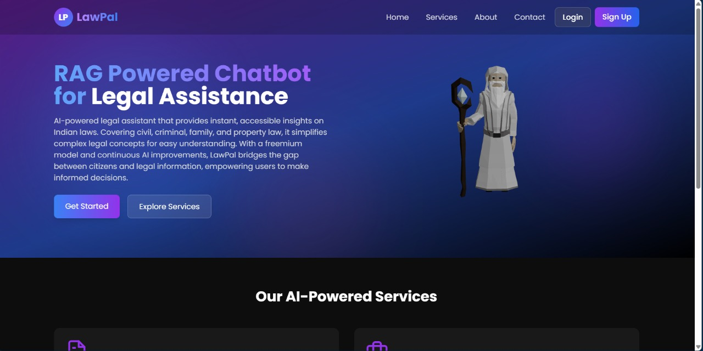
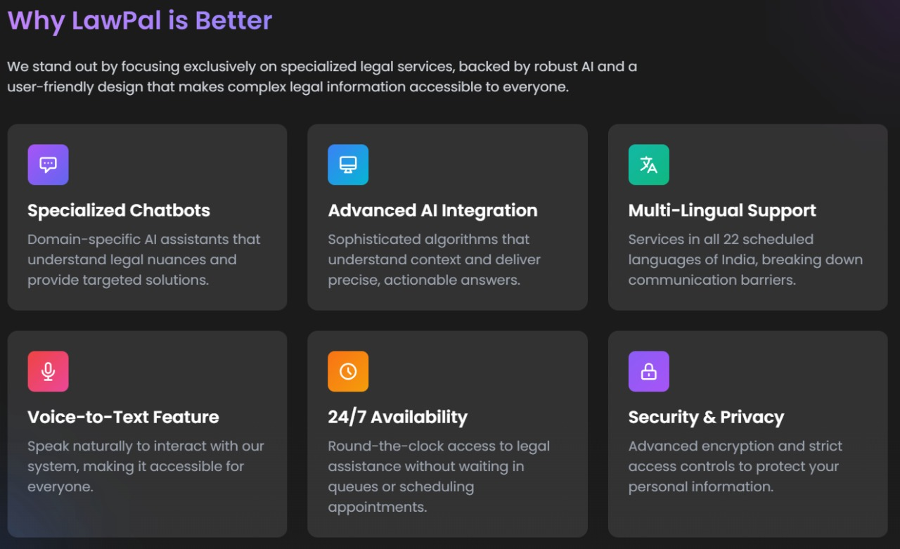
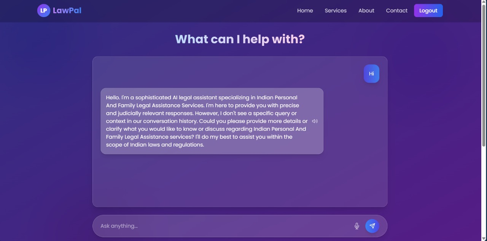

# **LawPal: AI-Powered Legal Assistance Chatbot**

## **Overview**
**LawPal** is an AI-driven chatbot designed to assist users with legal inquiries, document analysis, and case law retrieval. It simplifies legal research and provides real-time guidance by leveraging **Pinecone** for vector search, **Groq** for natural language processing, and **Flask** for backend services.  

---

## **Features**
- **Legal Chatbot**: Get instant answers to legal questions.  
- **Document Analysis**: Upload and analyze legal documents.  
- **Case Law Search**: Retrieve relevant case laws based on queries.  
- **Voice-to-Text & Text-to-Speech**: Interact using voice commands and listen to responses.  
- **Multi-Language Support**: Available in multiple languages for accessibility.  

---

## **Technologies Used**
- **Frontend**: Vite, React, Tailwind CSS  
- **Backend**: Flask, Pinecone, Groq  
- **Authentication**: Supabase Authentication  
- **Voice Recognition**: Web Speech API  
- **Text-to-Speech**: Web Speech API  
- **Routing**: React Router  
- **State Management**: React Hooks  

---

## **Setup Instructions**

### **1. Clone the Repository**
```bash
git clone https://github.com/AaryanGole26/LawPal.git
cd LawPal
```

### **2. Backend Setup**
- Navigate to the backend folder:  
  ```bash
  cd server
  ```
- Install Python dependencies:  
  ```bash
  pip install -r requirements.txt
  ```
- Set up environment variables:  
  Create a `.env` file in the backend folder and add:
  ```env
  PINECONE_API=your_pinecone_api_key
  PINECONE_ENV=your_pinecone_environment
  GROQ_API=your_groq_api_key
  SUPABASE_URL=your_supabase_url
  SUPABASE_KEY=your_supabase_api_key
  ```
- Run the Flask server:  
  ```bash
  python app.py
  ```
  The backend will run on `http://127.0.0.1:5000`.

### **3. Frontend Setup**
- Navigate to the frontend folder:  
  ```bash
  cd App/project
  ```
- Install Node.js dependencies:  
  ```bash
  npm install
  ```
- Start the development server:  
  ```bash
  npm run dev
  ```
  The frontend will run on `http://localhost:5173`.

### **4. Supabase Authentication**
- Set up a Supabase project at [Supabase Console](https://supabase.io/).  
- Add your Supabase configuration in `src/supabase.js`:
  ```javascript
  import { createClient } from '@supabase/supabase-js';

  const supabaseUrl = "YOUR_SUPABASE_URL";
  const supabaseKey = "YOUR_SUPABASE_API_KEY";

  export const supabase = createClient(supabaseUrl, supabaseKey);
  ```
- Enable **Email/Password** and **OAuth Authentication** in Supabase settings.  

---

## **Usage**
### **1. Access the Platform**
- Open your browser and go to `http://localhost:5173`.  
- Log in to access legal assistance services.  

### **2. Interact with the Chatbot**
- Type or speak legal queries to get AI-powered responses.  
- Upload legal documents for analysis and case law retrieval.  

---

## **Screenshots**

  
*Caption: LawPal Homepage*  

  
*Caption: Available Legal Services*  

  
*Caption: Chatbot in Action*  

---

## **Acknowledgments**
- **Pinecone** for vector search capabilities.  
- **Groq** for NLP-powered legal analysis.  
- **Flask & Vite-React** for building the backend and frontend.  
- **Supabase** for authentication and database management.  

